# Coffee Shops for Remote Work

This is a website, modelled off of [laptopfriendly.co](https://laptopfriendly.co/london) that shows coffee shops where
it is possible to work remotely for a day.

This website allows users to explore the coffee shops that are already in the database, suggest new locales, and flag if a shop is now closed. 

Future iterations will allow users to leave reviews and will show coffee shops on a map. I looked into using the
[flask_googlemaps](https://github.com/flask-extensions/Flask-GoogleMaps) package, but it is out of date with newer versions of flask and the google maps api.
I'll revisit when the package has been has been updated as per https://github.com/flask-extensions/Flask-GoogleMaps/pull/159).

## Screenshots

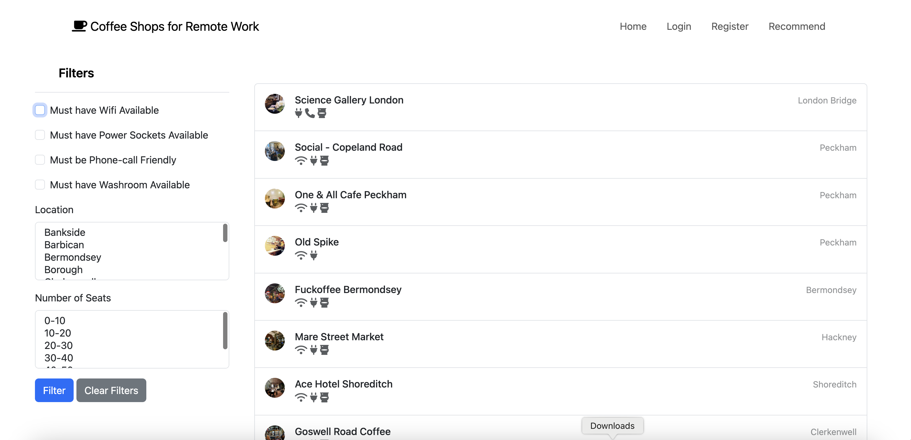
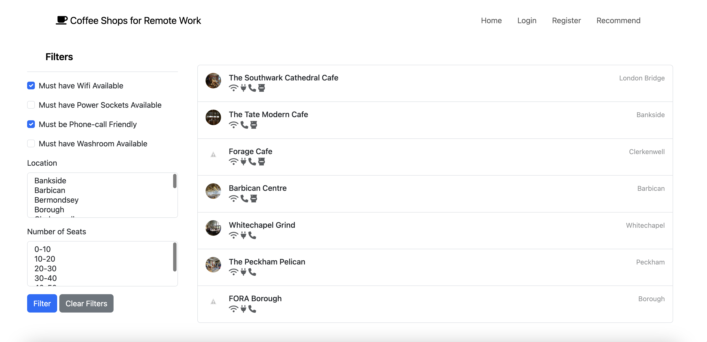
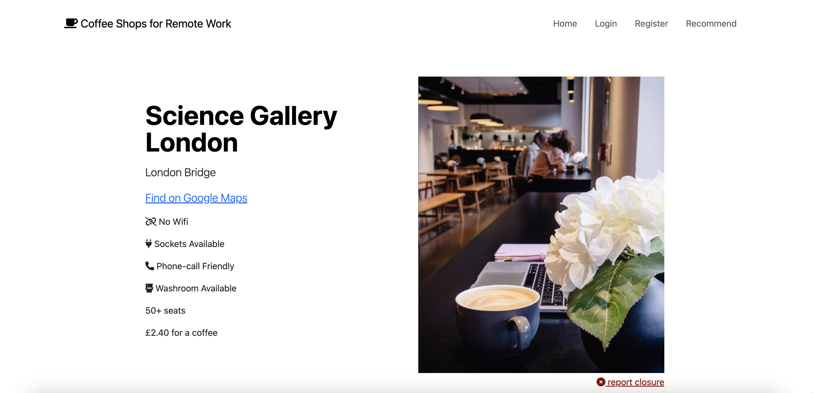
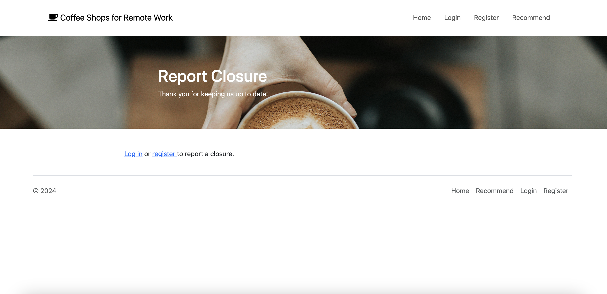
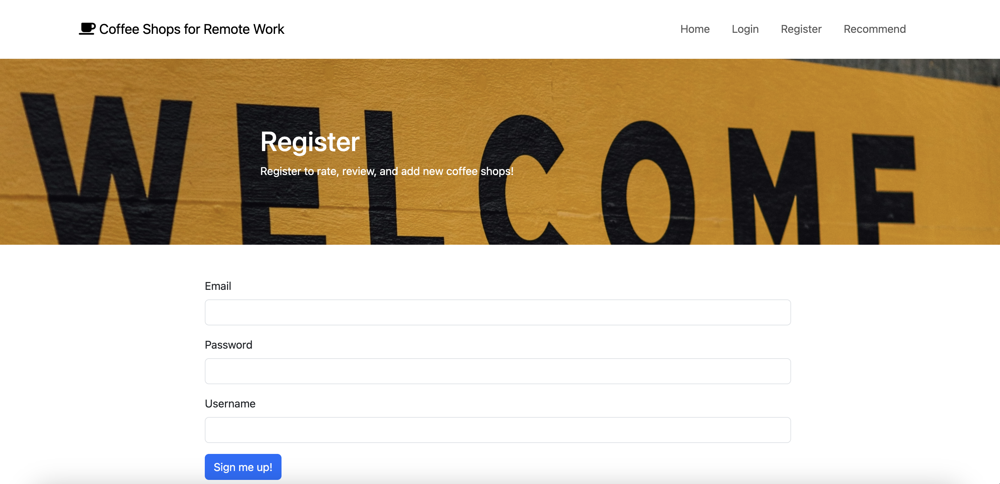
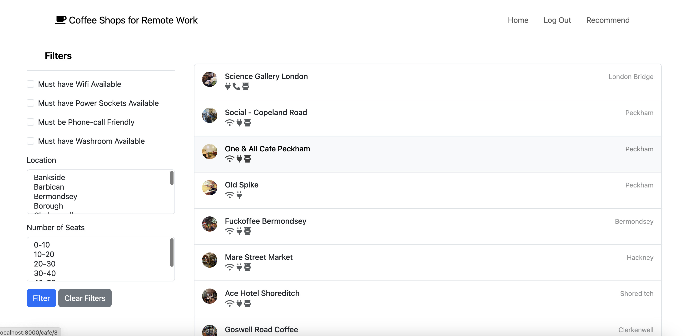
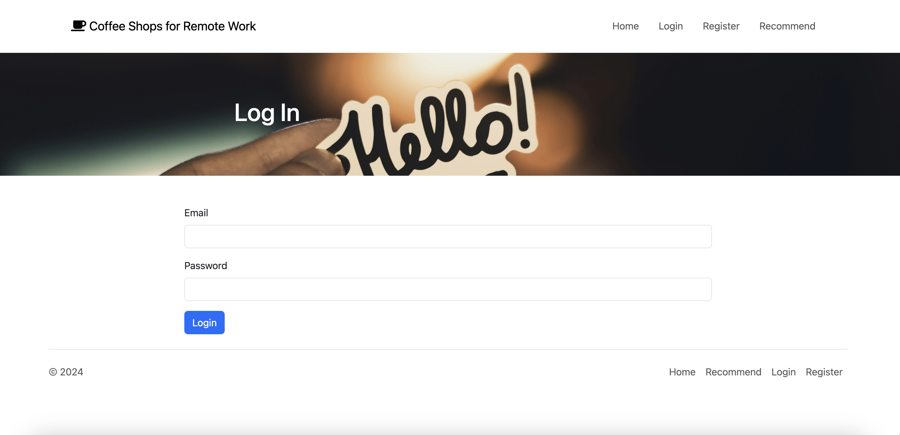
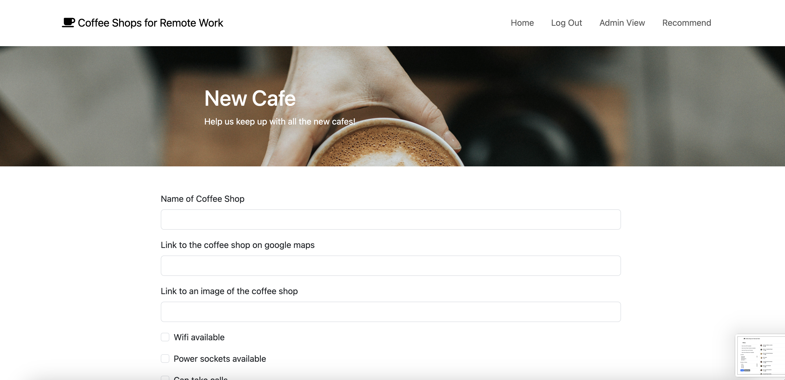
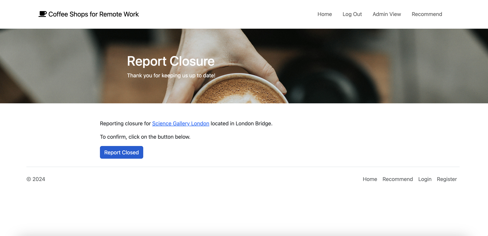
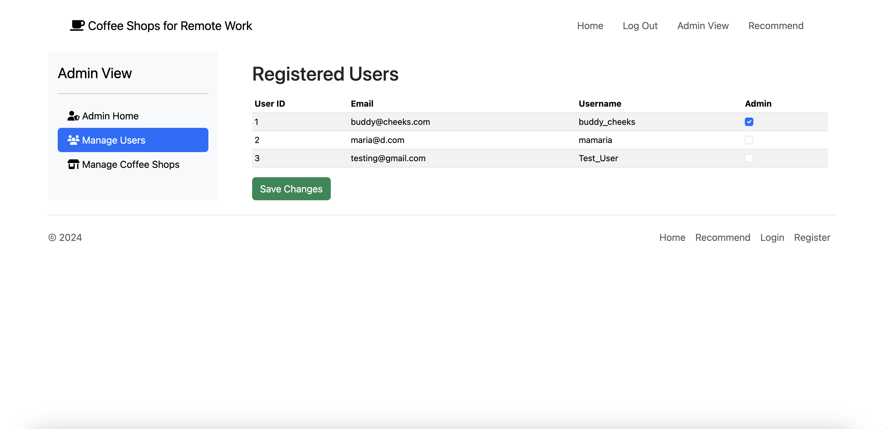
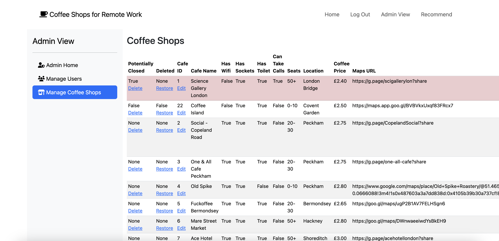
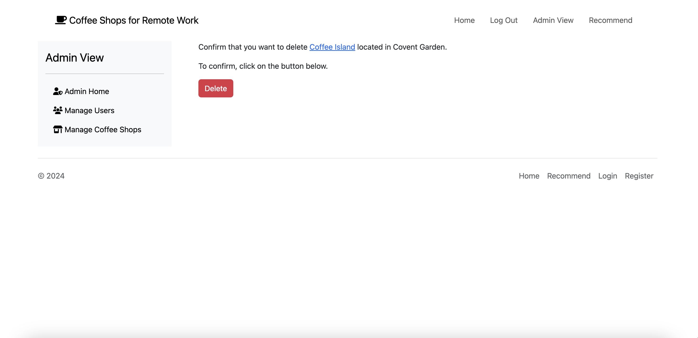
